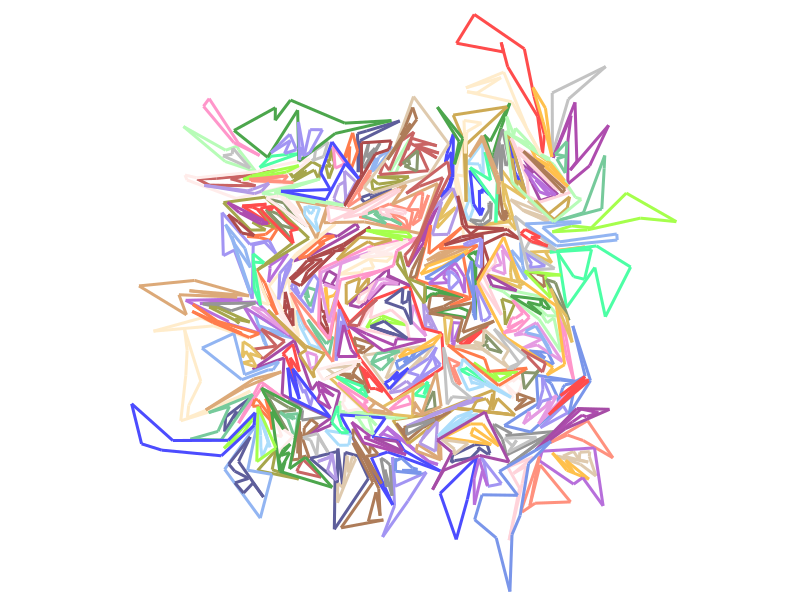
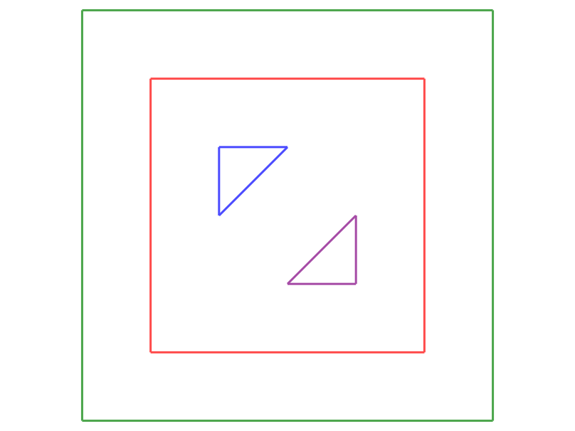

# Algorithm Project

Welcome to the algorithm project.

This year, we are focusing on polygon inclusion.

The topic is not complicated:

- We take as input a set of simple polygons.
- The program outputs which polygon is included in which other polygon.

## Input

We take input as a set of polygons from a *.poly* file.
This text file format follows the rules below:

- Each line consists of 3 elements separated by one or more spaces: an integer, a float, and a float.
- The two floats are the *x* and *y* coordinates of a point.
- The integer at the beginning of the line indicates to which polygon this point belongs, starting from 0.
- The order of the lines in the file indicates the order of the points of the polygons.
- Polygon indices are consecutive (all points of polygon 0, then all points of polygon 1, and so on).

When loading, each file is converted into a vector of polygons.

Note that there are **never** any segment intersections between two different polygons. Within the same polygon, only consecutive segments intersect, and only at their endpoints.

## Inclusion Detection

For this project, you are not given a complete algorithm. However, one of the basic algorithms you need to implement is to detect if a point is inside a polygon. This can be achieved by *starting* from the point in an arbitrary direction and counting the number of polygon segments crossed along the way. If the number is odd, the point is inside; if it is even, the point is outside. To avoid issues related to rounding errors and to simplify calculations, it is best to move either vertically or horizontally.

For more info, see [Wikipedia](https://en.wikipedia.org/wiki/Point_in_polygon).

## Output

The output should print on the standard output a vector indicating which polygon is (directly) included in which other polygon.
Each polygon is identified by its number. Since a polygon can be included in at most one other polygon, you only need to associate each polygon with the index of its parent or *-1* if it has none.
The easiest way to store this information is in a vector where the i-th entry contains the parent of the i-th polygon.

For example, the file *10x10.poly* provided contains the two polygons below:

The red polygon is number 0, and the green polygon is number 1. Since the green polygon is included in the red one, and the red polygon is not included in any other polygon, the solution is the vector [-1, 0].

Displaying the solution simply involves printing this vector, which is already implemented at line 30 of the *main.py* file provided.

A second example, the file *e2.poly* (0 is red, 1 is green, 2 is blue, 3 is purple):

has the solution: [1, -1, 0, 0].

## Provided Code

I have provided a small geometry module: *geo*.

This module contains all the basic classes (points, segments, polygons) as well as a display module based on *tycat*. All basic objects are displayable, as are iterables and iterators of basic objects.
You can see how it works by looking at the *hello.py* and *tycat.py* files.

The files *main.py*, *main1.py*, and *main2.py* contain the algorithms that have been developed.

